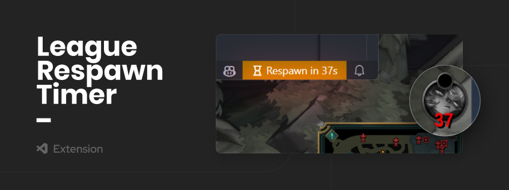

An extension to display **`League of Legends`** player respawn time in [Visual Studio Code](https://code.visualstudio.com).

 

#### Why did I make this extension?

_I play **`League of Legends`** and work on projects related to the game. To enhance my productivity, I'm planning to develop an extension that allows me to code and enjoy the game seamlessly._

## 🕹️ Features

- [x] **Display player respawn time**

## 🔧 How to use

1. **Install this extension.**
2. **Launch your `LeagueClient` and start your game.**
   When you are in the game, your `SummonerName` will be displayed in the status bar. Upon death, your respawn time will be displayed in the status bar instead of your `SummonerName`.

## 🪣 Commands

Press `Ctrl+Shift+P` to open the command palette, type `League Respawn Timer` and select the command you want to run.

- `league-respawn-timer.disable-timer`: Disable this extension.
- `league-respawn-timer.show-menu`: Show the menu.

## 🛠️ Configuration

| Name                                       |   Type    | Default | Description                    |
| :----------------------------------------- | :-------: | :-----: | :----------------------------- |
| `league-respawn-timer.enable`              | `Boolean` | `true`  | Enable or disable this plugin  |
| `league-respawn-timer.enable-notification` | `Boolean` | `true`  | Enable or disable notification |

## LICENSE

This extension is licensed under the [MIT](LICENSE)
